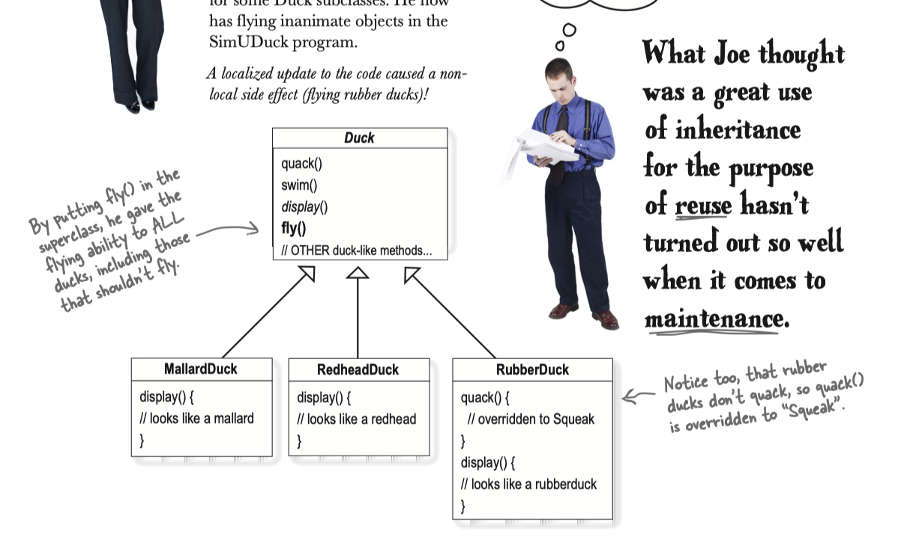
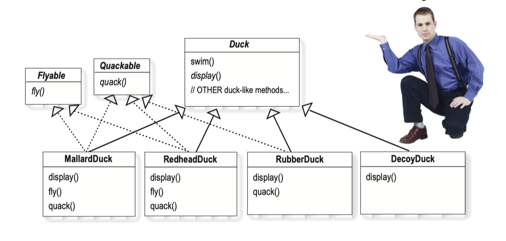
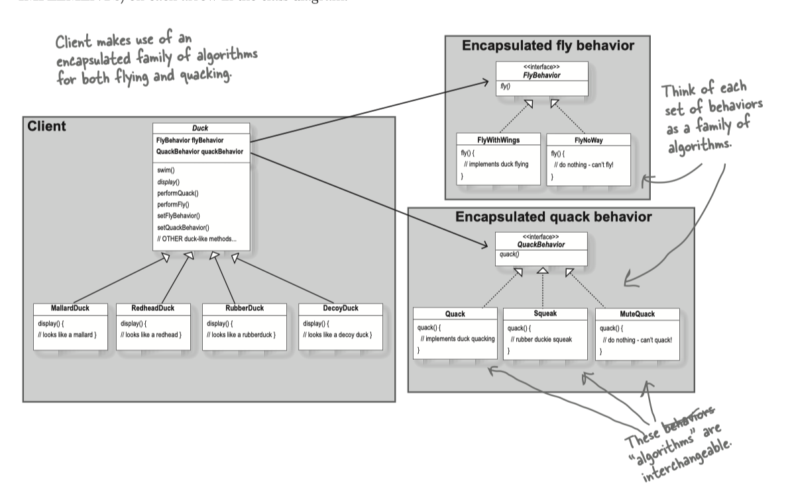

# Strategy Example: Duck 

reference: _head first design patterns_

### Initial Requirement

Problem: 
1. `quack()` and `swim()` are behavior. Behavior likely is various on different subclass. If subclass have different requirement on the virtual function, it need override the function.
2. Not all the subclass can conform to `fly()`. If not, the subclass have to override the empty function. 

> Design Principle:     
>__Prefer Composition to Inheritance__
>*  Composition = HAS-A
>*  Inheritance = IS-A

MallarDuck is a Duck, has the behavior of quack and swim. 

### Solution 1: 

Problems:
1. It will generate many duplicated code. Each class need to implement its own method of `fly()`. 
    > _Discussion:_     
    > You might suggest to provide default implementation of the abstract virtual function.     
    > But, if I have different methods for flying, how do I do?  And do I really need to care about the implementation? Why not leave it to the future extension? 

>__Design Principle__:      
> Program to an interface, not an implementation. 

_Discussion:_
Since Apple introduced _POP_ (Protocol oriented Programming), many developers think the code is POP because he has protocol. 
This is the bad design and often in our projects. 

### Solution 2: 

_Discussion:_
This is the good design for our TDD practice. 

