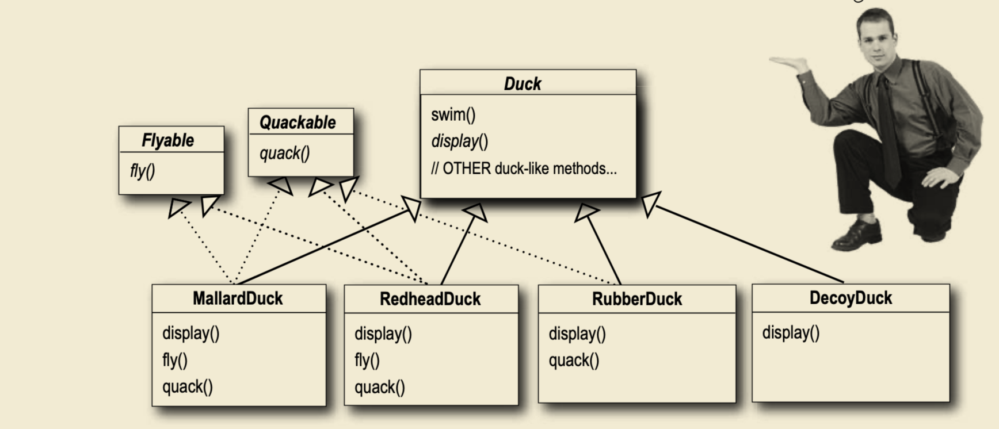

# SimUDuck Example 


__Reference:__  Head First, Design Patterns 2nd Edition


## Exist Project


```swift
import Foundation

class Duck {
    func quack() {
        print("generic quack")
    }
    func swim() {
        print("generic swim")
    }
    func display() {
        print("generic display")
    }
}

class MallardDuck: Duck {
    override func display() {
        print("mallard duck appearance")
    }
}

class RedheadDuck: Duck {
    override func display() {
        print("redhead duck appearance")
    }
}

//--- User -----
let mallardDuck = MallardDuck()
mallardDuck.display()

let redheadDuck = RedheadDuck()
redheadDuck.display()
```


### User Expectation

As a user, I want to a certain Duck, and perform `swim` or `quack` behaviour. 


###  Code Review

1. What’s the point to have `Duck` class here? 
    `let duck = Duck()`, but the duck is a generic object. 
2. __Program to Class__   Encapsulation, Inheritance and Polymorphism. Looks good.  However,  I have heard __Program to Class__ is not right, we prefer __Program to Protocol in Swift__. 

Let’s improve it as protocol version. 


```swift
import Foundation

protocol Duck {
    func quack()
    func swim()
    func display()
}

extension Duck {
    func quack() {
        print("generic quack")
    }

    func swim() {
        print("generic swim")
    }

    func display() {
        print("generic display")
    }
}

class MallardDuck: Duck {
     func display() {
        print("mallard duck appearance")
    }
}

class RedheadDuck: Duck {
    func display() {
        print("redhead duck appearance")
    }
}

class RubberDuck: Duck {
  	func display() {
    	print("Rubber Duck appearance")
  	}
}

//--- Test -----
let mallardDuck = MallardDuck()
mallardDuck.display()

let redheadDuck = RedheadDuck()
redheadDuck.display()

let rubberDuck = RubberDuck()
rubberDuck.display()
```


## New Requirement: Add `fly` function to Duck 


```swift
import Foundation

protocol Duck {
    func quack()
    func swim()
    func display()
    func fly()
}

extension Duck {
     func fly() {
          print("fly with wind")
     }
}

```


  🐞: `RubberDuck` Cannot fly. 


```swift
//...
class RubberDuck: Duck {
     func fly() {
    		return;  // I cannot fly, if someone call, I just return. 
     }
      
     //...
}
```


### Code Review

☑️ **Redundant Code** for `RubberDuck::fly`.  The function does nothing but we have to maintain the code. 

The `fly()` function is from the `protocol Duck`,  can I adopt the useful function I need? 





### Code Review:

1. Many classes  have to be added with `Flyable protocol`.  A bug would happen if we miss to add the flyable. 
2. We have to examine all the existing class and let the classes inherit with suitable behaviour. 


### Solution: DESIGN PRINCIPLE

> 1. Identify the aspects of your application that vary and separate them from what stays the same. 
> 2. Program to protocol, not an implementation. 
> 3. Prefer has-a to is-a


## Strategy Pattern


```swift
protocol FlyBehavior {
    func fly()
}

class FlyWithWings: FlyBehavior {
    func fly() {
        print("I'm flying!")
    }
}

class FlyNoWay: FlyBehavior {
    func fly() {
        print("I can't fly!")
    }
}
```


```swift
protocol QuackBehavior {
    func quack()
}

class Quack: QuackBehavior {
    func quack() {
        print("Quack")
    }
}

class Squeak: QuackBehavior {
    func quack() {
        print("Squeak")
    }
}

class MuteQuack: QuackBehavior {
    func quack() {
        print("<< Silence >>")
    }
}
```


```swift
class Duck {
    var flyBehavior: FlyBehavior
    var quackBehavior: QuackBehavior

    init(flyBehavior: FlyBehavior, quackBehavior: QuackBehavior) {
        self.flyBehavior = flyBehavior
        self.quackBehavior = quackBehavior
    }

    func performQuack() {
        quackBehavior.quack()
    }

    func swim() {
        print("All ducks float, even decoys!")
    }

    /* abstract */ func display() {
        print("display() MUST BE OVERRIDDEN")
    }

    func performFly() {
        flyBehavior.fly()
    }
}
```


```swift
class ModelDuck: Duck {
    init() {
        // Our model duck begins life grounded, without a way to fly.
        super.init(flyBehavior: FlyNoWay(), quackBehavior: Quack())
    }

    override func display() {
        print("I'm a model duck")
    }
}
```


```swift
class FlyRocketPowered: FlyBehavior {
    func fly() {
        print("I'm flying with a rocket!")
    }
}

```


```swift
let model = ModelDuck()
model.display()
model.performFly()
model.flyBehavior = FlyRocketPowered()
model.performFly()
```

