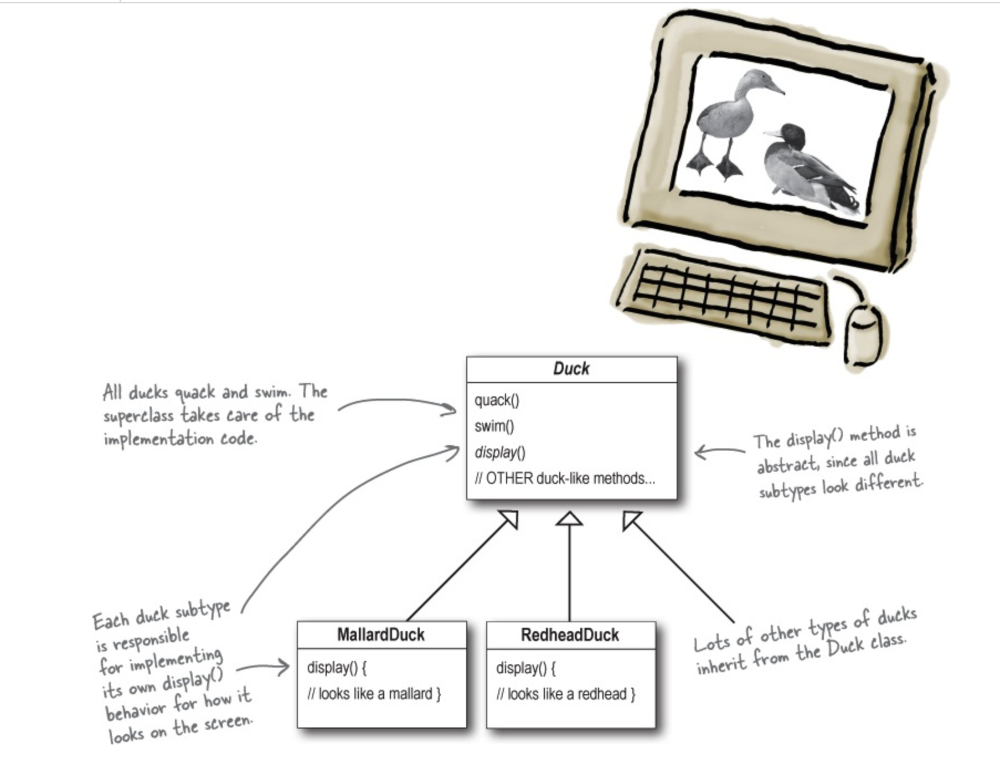
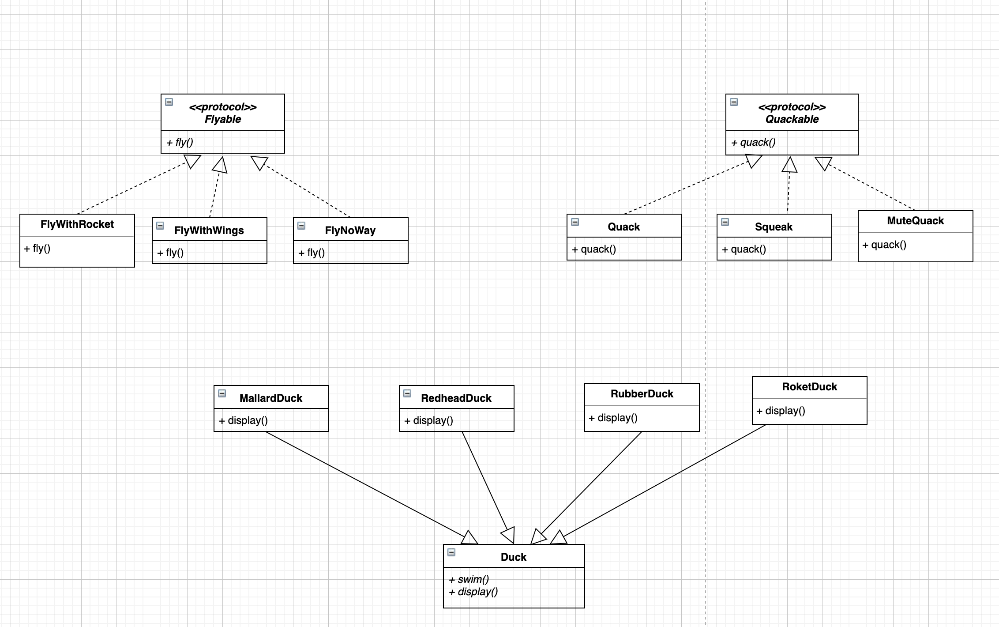
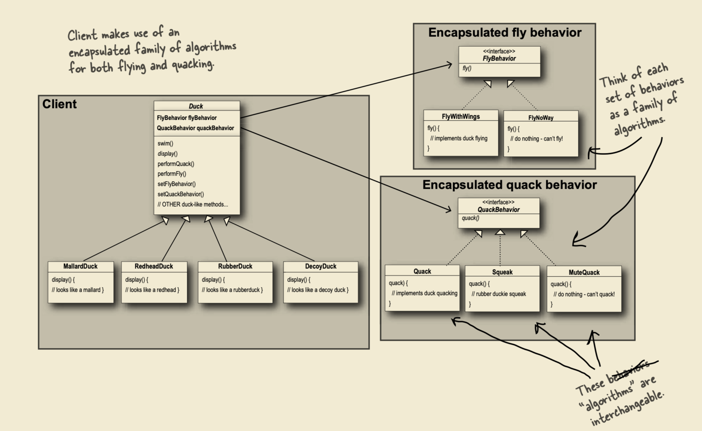

# SimUDuck Example 


__Reference:__  Head First, Design Patterns 2nd Edition


## Exist Project





```swift
import Foundation

class Duck {
    func quack() {
        print("generic quack")
    }
    func swim() {
        print("generic swim")
    }
    func display() {
        print("generic display")
    }
}

class MallardDuck: Duck {
    override func display() {
        print("mallard duck appearance")
    }
}

class RedheadDuck: Duck {
    override func display() {
        print("redhead duck appearance")
    }
}

class RubberDuck: Duck {
  	override func display() {
    	  print("Rubber Duck appearance")
  	}
}

//--- User -----
let mallardDuck = MallardDuck()
mallardDuck.display()

let redheadDuck = RedheadDuck()
redheadDuck.display()
```


###  Code Review

1. What’s the point to have `Duck` class here? 
    `let duck = Duck()`, but the duck is a generic object. 
2. __Program to Implementation__   Encapsulation, Inheritance and Polymorphism. Looks good.  However,  I have heard __Program to Class__ is not right, we prefer __Program to Protocol in Swift__. 

Let’s improve it as protocol version. 


```swift
import Foundation

protocol Duck {
    func quack()
    func swim()
    func display()
}

extension Duck {
    func quack() {
        print("generic quack")
    }

    func swim() {
        print("generic swim")
    }

    func display() {
        print("generic display")
    }
}

class MallardDuck: Duck {
     func display() {
        print("mallard duck appearance")
    }
}

class RedheadDuck: Duck {
    func display() {
        print("redhead duck appearance")
    }
}

class RubberDuck: Duck {
  	func display() {
    	print("Rubber Duck appearance")
  	}
}

//--- Test -----
let mallardDuck = MallardDuck()
mallardDuck.display()

let redheadDuck = RedheadDuck()
redheadDuck.display()

let rubberDuck = RubberDuck()
rubberDuck.display()
```


### Code Review: 

So far everything looks good if the requirement is just simple. 


## New Requirement

`FlyWithWings, FlyWithRocket, Quack, MuteQuack and Squeak`


### Before start: Well known Design Principle



As an experienced developer, we need to think about design principle when we apply requirement changes. 

> 1. Identify the aspects of your application that vary and separate them from what stays the same. 
> 2. Program to protocol, not an implementation. 
> 3. Prefer has-a to is-a


```swift
import Foundation

/* *********** fly   ****************/
protocol Flyable {
    func fly()
}

protocol FlyWithWings: Flyable { }
extension FlyWithWings {
    func fly() {
        print("I can fly with wings")
    }
}

protocol FlyNoWay: Flyable { }
extension FlyNoWay {
    func fly() {
        print("I cannot fly")
    }
}

protocol FlyWithRocket: Flyable { }
extension FlyWithRocket {
    func fly() {
        print("I can fly with rocket")
    }
}

/* ************ quack ***************/
protocol Quackable {
    func quack()
}

protocol Quack: Quackable { }
extension Quack {
    func quack() {
        print("I can quack")
    }
}

protocol Squeak: Quackable { }
extension Squeak {
    func quack() {
        print("I can squeak")
    }
}

protocol MuteQuack: Quackable { }
extension MuteQuack {
    func quack() {
        print("I can not quack")
    }
}


/* ************* Duck **************/
protocol Duck {
    func swim()
    func display()
}

extension Duck {
    func swim() {
        print("All duck can sim")
    }
}

class MallardDuck: Duck, FlyWithWings, Quack {
    func display() {
        print("Mallard Duck Appearance")
    }
}

class RedhatDuck: Duck, FlyWithRocket, Quack {
    func display() {
        print("Redhead Duck Appearance")
    }
}

class RubberDuck: Duck, FlyNoWay, MuteQuack {
    func display() {
        print("Rubber Duck Appearance")
    }
}
```


### Code Review:

1. Do you think this will be the maintenance nightmare? 
2. Can I apply FlyWithWings and FlyWithRocket together? 


## Better Way: Strategy Pattern





```swift
protocol Flyable {
    func fly()
}

class FlyWithWings: Flyable {
    func fly() {
        print("I'm flying!")
    }
}

class FlyNoWay: Flyable {
    func fly() {
        print("I can't fly!")
    }
}

protocol Quackable {
    func quack()
}

class Quack: Quackable {
    func quack() {
        print("Quack")
    }
}

class Squeak: Quackable {
    func quack() {
        print("Squeak")
    }
}

class MuteQuack: Quackable {
    func quack() {
        print("<< Silence >>")
    }
}

class Duck {
    var Flyable: Flyable
    var Quackable: Quackable

    init(Flyable: Flyable, Quackable: Quackable) {
        self.Flyable = Flyable
        self.Quackable = Quackable
    }

    func performQuack() {
        Quackable.quack()
    }

    func swim() {
        print("All ducks float, even decoys!")
    }

    /* abstract */ func display() {
        print("display() MUST BE OVERRIDDEN")
    }

    func performFly() {
        Flyable.fly()
    }
}

class ModelDuck: Duck {
    init() {
        // Our model duck begins life grounded, without a way to fly.
        super.init(Flyable: FlyNoWay(), Quackable: Quack())
    }

    override func display() {
        print("I'm a model duck")
    }
}

class FlyRocketPowered: Flyable {
    func fly() {
        print("I'm flying with a rocket!")
    }
}


let model = ModelDuck()
model.display()
model.performFly()
model.Flyable = FlyRocketPowered()
model.performFly()
```

