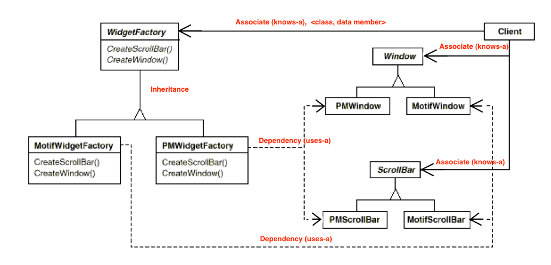

# Abstract Factory 

Reference: GOF



怎么理解这个图?

**从client 角度看:**

> *知识点: Widget 包含 Window,ScrollBar*
>
> Client: 我需要一个 widget, 它可以是 Motif-theme 的 widget, 也可以是 PM-theme 的 widget, 这个就看我心情啦.
> Client: 我还需要对 Window 和 ScrollBar 进行直接控制, ScrollBar滑动的时候我需要做Event 响应.


**最初的不解**

我觉得为什么作为用户又要知道 WidgetFactory,还要知道 Window 和 ScrollBar呢? 我的意思是难道不可以从 WidgetFactory 中使用 get 获取吗?
其实这是对 Factory 的一个误解, Factory 的职责是告诉你我有什么"套装的产品",而不是用来管理"套装的各个产品". 我的误解来自于 iOS 中 ViewController,
也以为需要有个大管家来管理M 和 C 的模块. 这里Factory 模式很单一,职责也很明确,就是"定义套装了有什么产品"


## 看图写代码

首先要理解 UML 的图例代码意义, 找个什么依赖都没有的,就是产品. 他自己管自己, 除此之外没有什么其他人和人之前的关系.

### 产品实现

```c++
class Window  {
};
// ---------
class MotifWindow : public Window {
};
// ---------
class PMWindow : public Window {
};
```

类似的, ScrollBar 也是这样,

```c++
class ScrollBar  {
};
// ---------
class MotifScrollBar : public ScrollBar {
};
// ---------
class PMScrollBar : public ScrollBar {
};
```

### Factory 实现

```c++
class WidgetFactory {
public:
  // 定义套装有什么产品
  virtual Window * createWindow();  //套装中有 Window
  virtual ScrollBar * createScrollBar(); // 套装中有 ScrollBar
};

class MotifFactory : public WidgetFactory {
public:
  Window * createWindow() {
    return new MotifWindow();    // 这里是什么关系? 虚线箭头是 dependency 关系, 弱关系,不是 data member, 不需要保留,一次性.
  }
  
  ScrollBar * createScrollBar() {
    return new MotifScrollBar();  // 同理, 虚线箭头是 dependency 关系, 弱关系,不是 data member, 不需要保留,一次性.
  }
}

//类似的, 
class PMFactory : public WidgetFactory {
public:
  Window * createWindow() {
    return new PMWindow();    //  同理, 虚线箭头是 dependency 关系, 弱关系,不是 data member, 不需要保留,一次性.
  }
  
  ScrollBar * createScrollBar() {
    return new PMScrollBar();  // 同理, 虚线箭头是 dependency 关系, 弱关系,不是 data member, 不需要保留,一次性.
  }
}
```

### Client 的实现

```c++
int main() {

  // UML 中什么关系?
  // association 关系, knows-a, 实线剪头,表示用户要直接使用这些对象实例.
  WidgetFactory * factory = PMWidgetFactory();   // 用户已经知道他要选择什么套装了.
  Window * window = factory->createWindow();     // 用户通过 factory 来创建该套装的组件.
  ScrollBar * scrollBar = factory->createScrolBar();  // 同理
  
  // 创建完成后,用户自己玩 Window 和 ScrollBar 去了, factory 也就没有什么用处了.
}
```
完整代码参见 sample/case01, c++

## 我个人的理解

我看了很多例子,感觉都很牵强,自己想到一个例子觉得很贴切,也符合 factory 这个名号,


我作为用户,我买单反相机,首先我要在Nikon 和 Canon 等其他品牌中选择, 如果我买了 Canon, 我的 CameraBody 是 Canon, 我的Lense也需要是 Canon 接口的, Lense 还分不同焦段. 
我平时还需要分开去相机店清洗和保养,这就是为什么 Factory 模式中, Client 要直接对 Product 进行管理的原因.
现实中,我的 Canon 相机就是配的 Canon 自己一个镜头. 通过这个例子,就可以很好的理解为什么 Factory 针对性的是一个 kit, 这个 kit 也就是套装,
也就是 Canon 系列的套装.


https://paginas.fe.up.pt/~aaguiar/as/gof/hires/pat3afso.htm