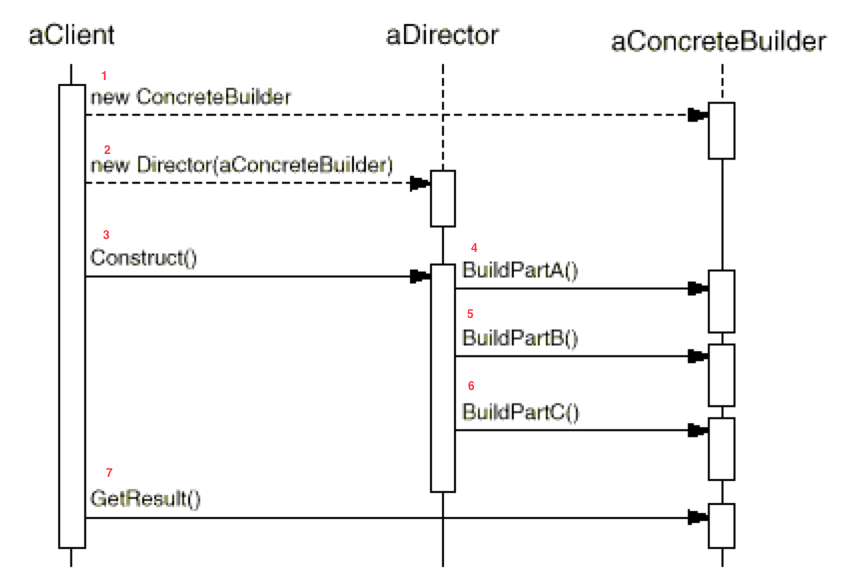
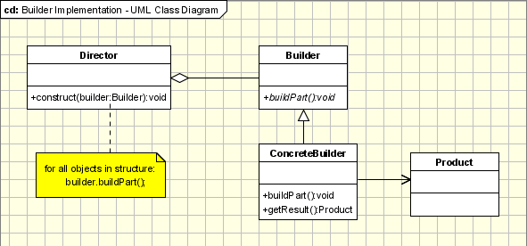
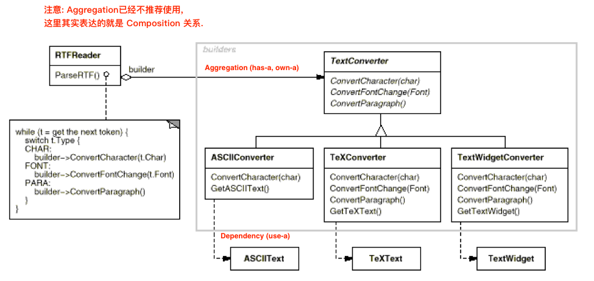
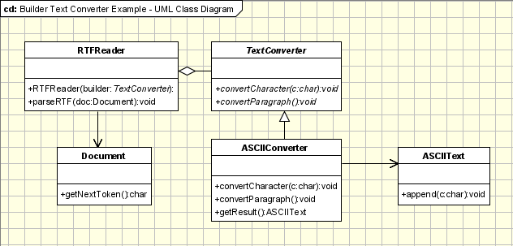

# Builder Design Patterns

_参考: GOF, builder_

## 情景

有个要做一个 RTF(Rich Text Format)阅读器,用来解析 RTF 文本,并且希望输出不同格式,比如 ASCII 格式, TeX 格式和 TextWidget(我不清楚这是什么格式, Google不到.)

## 理解 时序图

aClinet, 管理"输入"和"输出"

* 输入: 主要目的是创建 Director. Director 需要知道要 Build 什么,所以还要创建 Builder
  * 创建 Builder
  * 创建 Director
* 告诉 Director 进行Construct工作.

aDriectory: 根据要求来构建各个部分组件.

aClient: 

* 获取结果

理解 UML 图

## 看 UML 图写代码

开始写这个 code 时候,写到" dependency(use-a)"关系的时候写不下去了. 因为 dependency 的 cpp 意义是作为函数参数传入的.
但是在 ASCIIConverter 里边有 `GetASCIIText()`, 这是说 ASCIIText 必须是一个 data member, 这和 dependency 是矛盾的. 
所以,在 GOF 中给出这个图, 我觉得是错误的. 我 google 后,发现这个图比较正确, 那么看这个图写程序, 

[oodesign.com](http://www.oodesign.com/builder-pattern.html)

