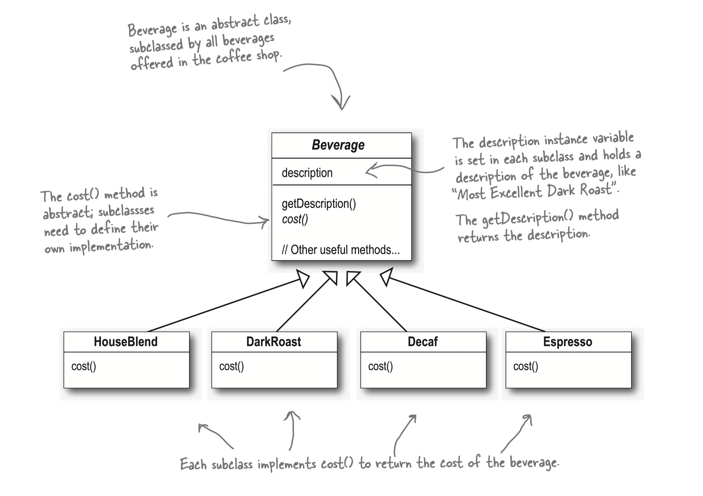
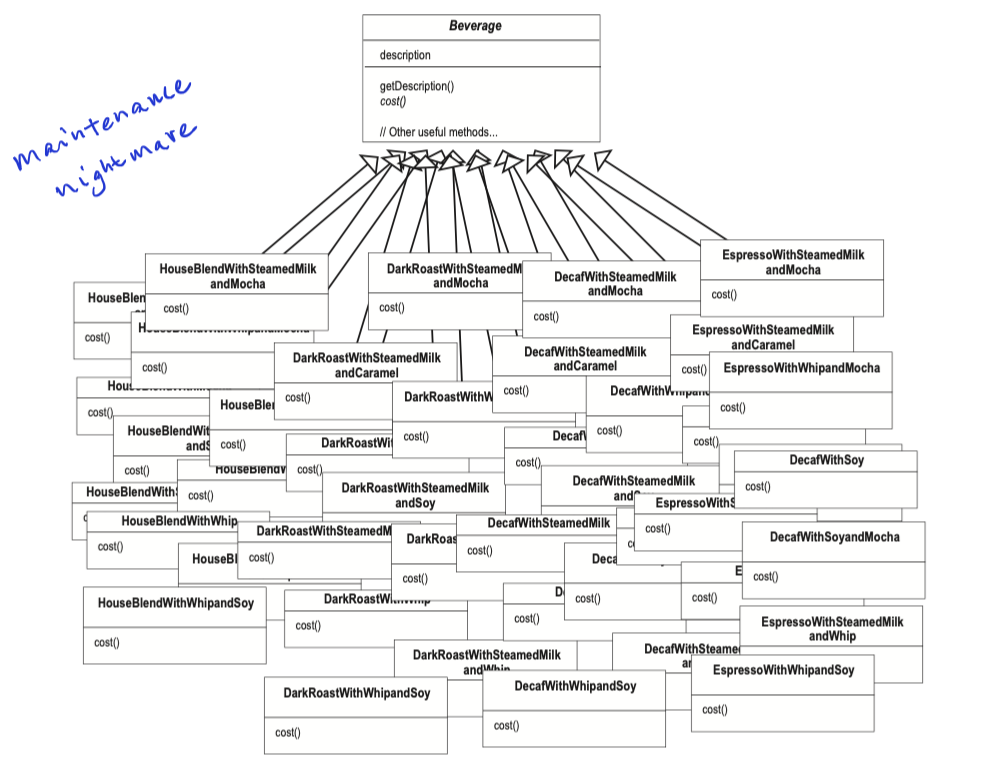
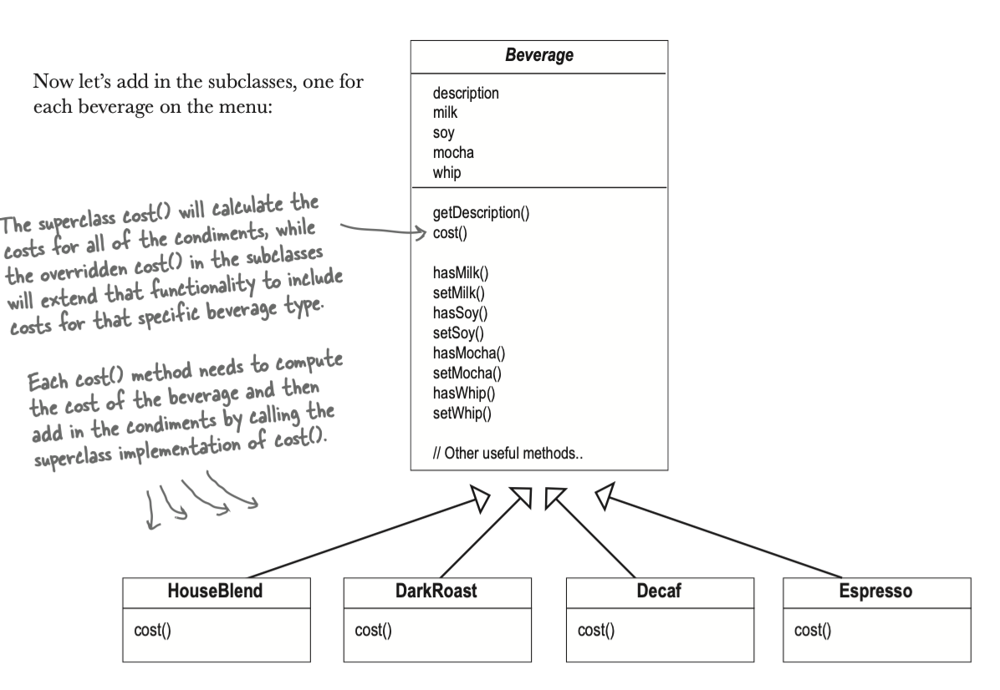
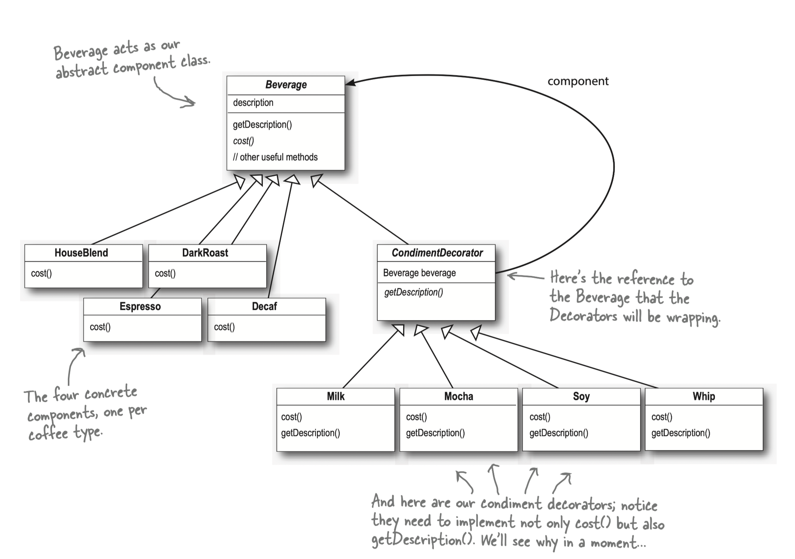

# Starbuzz Example

## Day 1
> Story:  MVP Stage
> I run a coffee machine, and sell following coffee,
> 1. HouseBlend
> 2. DarkRoast
> 3. Decaf
> 4. Espresso
> 
> __Scenarios:__   
> When client order a cup of coffee, we show tell him/her the price. 

## Day 2
> Story:  Expend business
> Custom like toppings, SteamMilk, mocha, caramel, soy. And sometimes they want to have double. 
> We'd like to support the following drink,
> 1. HouseBlend + SteamMilk + Mocha
> 2. HouseBlend + SteamMilk
> 3. HouseBlend + Mocha
> 4. HouseBlend + soya
> 5. HouseBlend + Mocha + Soay
> ...

And breaking news,

> The developer is going to leave, you have to take his job.     
> __How to think as a senior?__

Senior developers think about design principle, because we want make our lives easier.      
1. Try not modify the existing code or less, so it will have less impact, and prevent regression bugs. 
   * How do you know how much test cases have covered by previous developer? 
   * Does the previous developer apply magic number or work around of bugs? 

2. Can I extend the code rather than modifying? 

>__Design Principles: OPC__     
> Open to extension and close to modification.

The design will create maintenance nightmare. 
       
The design will modify the existing code, which likely will break the existing workflow or regression bugs.       

We need to find out other way to implement. 

## Decorator Pattern
`extension`, `wrapper`     

> __Decorator Pattern__
> 1. It attaches additional responsibilities to an object dynamically.
> 2. Decorator provide flexible alternative to subclassing for extending functionality. 
> 3. Conform "SRP" Single Responsibility  Principle
> 4. Conform "OCP" Open Close Principle

