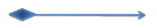

# UML 


## Dependency`use a`


## Association `has a`


```cpp
class Foo { 
public:
	void Baz(Bar bar) {
    } 
};
```
`Foo` and `Bar` is in association.

## Aggregation `own a`


```cpp
class Foo { 
    private Bar bar; 
    Foo(Bar bar) { 
       this.bar = bar; 
    }
}
```


## Composition `is a part of`



```cpp
class Foo {
private:
    Bar * m_bar;
}

```


